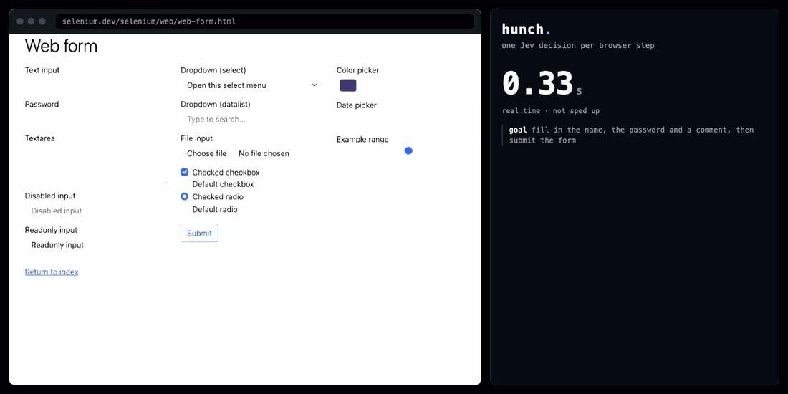
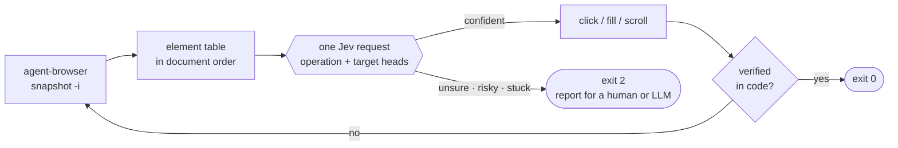

<h1 align="center">hunch</h1>

<p align="center">
  <b>A browser agent that acts on a hunch, and asks for help when the hunch is weak.</b><br>
  Every click is one ~150&nbsp;ms decision from <a href="https://typesafe.ai">Jev</a>, TypeSafe's System One model, running on top of
  <a href="https://github.com/vercel-labs/agent-browser">agent-browser</a>. An LLM is only needed when confidence drops.
</p>

<p align="center">
  <a href="https://github.com/HAR5HA-7663/hunch/actions/workflows/ci.yml"></a>
  
  
  
</p>

<p align="center">
  
  <br><sub>Real time, not sped up. Four Jev decisions, 675&nbsp;ms of "thinking" in total, success verified in code.</sub>
</p>

## The idea

LLM browser agents think hard at every step: read the page, reason, pick an element, repeat. But most steps in a
browser are not hard. *Type the email. Type the password. Click "Sign in".* That is reflex, not reasoning.

**hunch gives your browser agent reflexes.** Each step is a single request to [Jev](https://docs.typesafe.ai), a model that
doesn't generate text at all: it returns typed, calibrated decisions. hunch asks it *which operation* and *which element*
in the same request, runs the action through `agent-browser`, and checks the outcome **in code**.

When the hunch is weak (low confidence, a page that stopped changing, a click that looks irreversible), hunch stops and
hands back a precise report. That is the moment to spend an LLM call, and usually the only one.

## Numbers

Measured on this machine, reproducible with [`bench/decision_latency.py`](bench/decision_latency.py):

| Per decision, same four page states, 24 calls each | median | p90 | correct |
|---|---|---|---|
| **Jev** (`jev-1.13.0`) | **153 ms** | 181 ms | 24 / 24 |
| `gpt-4o-mini` (JSON mode, temperature 0) | 678 ms | 1050 ms | 24 / 24 |

| A whole run (the GIF above) | |
|---|---|
| Open page, 3 fields, submit, verify | **3.4 s** end to end |
| Time spent deciding | 675 ms across 4 requests |
| Cost of those decisions | about $0.0002 (≈1,000 input tokens per step at $0.042 / 1M) |

Read these honestly: one simple task, a small fast LLM as the baseline, one network location. Both models got every
decision right here, so the difference is latency and cost, not accuracy. A full step also pays ~330 ms for the snapshot
and ~170 ms for the action, identical for any model, so end-to-end gains are smaller than the per-decision gap.

## Quickstart

```bash
# 1. the browser layer
npm install -g agent-browser && agent-browser install

# 2. hunch itself (pure standard library, nothing else gets installed)
pipx install git+https://github.com/HAR5HA-7663/hunch      # or: uv tool install git+https://github.com/HAR5HA-7663/hunch

# 3. a Jev key from https://console.typesafe.ai/keys
export TYPESAFE_API_KEY=...
```

```bash
export DEMO_PASSWORD='correct-horse-battery'
hunch --url https://www.selenium.dev/selenium/web/web-form.html \
      --goal "Fill in the text input with the name, fill in the password, then submit the form." \
      --value name=literal:"Ada Lovelace" --value password=env:DEMO_PASSWORD \
      --done-text "Received!"
```

```jsonc
{"step": 1, "op": "TYPE_TEXT", "op_conf": 0.99, "target": "textbox \"Text input\" <- name", "jev_ms": 340, ...}
{"step": 2, "op": "TYPE_TEXT", "op_conf": 1.0,  "target": "textbox \"Password\" <- password", "jev_ms": 120, ...}
{"step": 3, "op": "CLICK",     "op_conf": 0.99, "target": "button \"Submit\"", "p_irreversible": 0.17, "jev_ms": 162, ...}
{"status": "done_verified", "steps": 3, "jev_calls": 3, "seconds": 2.78, ...}
```

More in [`examples/`](examples).

## How it works



`agent-browser snapshot -i` already yields what Jev wants: a numbered table of interactive elements.

```text
[e7]  textbox "Email Address *" · empty
[e17] textbox "Password *" · empty
[e10] button "Sign In"
```

One request carries several *heads*. Only the head that matches the chosen operation is used, so picking *what to do* and
*what to do it to* costs one round trip instead of two (the speculative fan-out idea from
[jev-ultrafast](https://github.com/browser-use/jev-ultrafast)):

| Question | Type | Answers |
|---|---|---|
| `operation` | choice | `CLICK` · `TYPE_TEXT` · `SCROLL_DOWN` · `WAIT` · `DONE` · `BLOCKED` |
| `click_target` | choice | one of the clickable refs |
| `type_target` / `type_value` | choice | a text field, and the *name* of a value you supplied |
| `irreversible` | yes/no probability | would this click delete, send, or spend something? |

## Safe by construction

Speed is only useful if the agent can be trusted with a logged-in browser. These are enforced in code, not in a prompt:

- **Your values never leave your machine.** Jev sees the *names* (`email`, `password`). The text goes straight to the browser.
  Field contents in the snapshot are reduced to `filled` / `empty`, and the URL's query string is dropped.
- **Success is verified, never believed.** `DONE` from the model means nothing without `--done-url` / `--done-text` agreeing.
- **Confidence gate.** Below `--min-conf` (default 0.75) hunch does not act. A page that is merely still loading is waited
  on rather than escalated, because waiting touches nothing.
- **Irreversible-click guard.** Two independent signals, either one stops the click: a word list in code
  (`delete`, `pay`, `send`, `publish`, …) and Jev's own probability that the effect cannot be undone.
- **Origin allow-list.** hunch refuses to act outside the origin it started on unless you pass `--allow-origin`.
- **No loops.** Two actions in a row that change nothing on the page end the run.
- **Model output is never code.** Jev can only choose among refs and names hunch listed. Nothing it returns becomes a
  selector, JavaScript, or a shell command.

## Use it under an LLM agent

hunch is designed to be the fast path beneath Claude Code, Codex, or any agent that already drives a browser: let it run the
routine stretch, and take over only when it exits `2`.

```jsonc
// exit code 2
{
  "status": "escalate",
  "reason": "blocked",                       // low_confidence · risky_click · no_progress · stuck_waiting ·
                                             // left_allowed_origin · done_not_verified · step_limit · jev_error
  "visible_text": "… Invalid email or password …",
  "history": ["typed the email into textbox \"Email Address *\"", "…", "clicked button \"Sign In\""],
  "elements": ["[e7] textbox \"Email Address *\" · filled", "…"]
}
```

`hunch --dry-run --goal "…"` answers *"what would you click here?"* for the current page without touching it, which makes
it a cheap second opinion inside an existing agent loop.

A ready-made skill teaches Claude Code (or any agent that reads `SKILL.md`) when to reach for hunch and how to act on an escalation:

```bash
npx skills add HAR5HA-7663/hunch      # installs .claude/skills/hunch/SKILL.md, same mechanism agent-browser uses
```

As a library:

```python
from hunch import Agent, Config
from hunch.adapters import AgentBrowser, Jev

result = Agent(AgentBrowser("my-session"), Jev(),
               Config(goal="Sign in with the email and the password.",
                      values={"email": "qa@example.com", "password": os.environ["QA_PASSWORD"]},
                      url="https://staging.example.com/login", done_url=r"/dashboard")).run()
print(result.status, result.seconds)
```

## CLI

| Flag | Meaning |
|---|---|
| `--goal TEXT` | what to achieve, in plain language |
| `--url URL` | page to open first (otherwise the session's current page) |
| `--value NAME=env:VAR` \| `NAME=literal:TEXT` | something hunch may type; repeatable |
| `--done-url REGEX`, `--done-text TEXT` | how success is verified in code |
| `--allow-origin ORIGIN` | extra origins hunch may act on |
| `--min-conf 0.75` | confidence required to act |
| `--allow-risky` | permit clicks the guard considers irreversible |
| `--dry-run` | decide, don't act |
| `--no-page-text` | send only the element table, not the first 800 chars of visible text |
| `--session NAME` | agent-browser session (default `hunch`, or `$AGENT_BROWSER_SESSION`) |
| `--max-steps`, `--settle-ms`, `--wait-ms`, `--max-waits`, `--model`, `--quiet` | tuning |

Exit codes: `0` goal verified · `2` escalated · `3` model says done but no verifier given · `1` error.
`HUNCH_KEY_CMD` can hold a command that prints the key, so it can live in a vault instead of your environment.

## Limitations

This is an early, deliberately small tool. Know what it does not do:

- **It cannot invent text.** Jev does not generate; hunch types only the values you pass. Free-form typing needs an LLM.
- **Not yet supported:** `<select>` choices, file uploads, iframes, shadow DOM, canvas apps, drag and drop, pop-up tabs.
- **Jev reads literally** and is weak at counting, dates and multi-hop reasoning
  ([known limitations](https://docs.typesafe.ai/model-jaggedness/jev-1.13.md)). Write goals as plain, direct instructions.
- **Jev is not deterministic.** The same input can move a probability by about ±0.05, which is why the gate has margin.
- **Page text is model input.** A hostile page can try to steer the decision. The allow-list, the click guard and the fact
  that Jev can only pick from a fixed list limit the blast radius; they do not make untrusted pages safe.
- **Hosted model.** Element labels and a slice of visible text go to TypeSafe's API. Use `--no-page-text`, and think before
  pointing it at pages full of other people's data.
- **Evidence so far is thin:** a handful of flows, not a benchmark suite. Reports of where it breaks are the most useful
  contribution right now.

## FAQ

**What is Jev?** A "System One" model from TypeSafe AI. You send it state plus typed questions (choice, score, yes/no) and
get calibrated probabilities back in roughly 100–300 ms. It does not write text, so it cannot return a malformed answer.

**How is this different from browser-use's jev-ultrafast?** Same core trick, different shape. jev-ultrafast is a standalone
agent with its own Chrome harness and a small LLM for typing. hunch is a thin, dependency-free layer over `agent-browser`
built to sit *under* an existing LLM agent: it has no LLM of its own, verifies outcomes in code, and is built around
escalating cleanly.

**Does my password get sent to TypeSafe?** No. Only the value's name is sent. There is a test for it.

**Can I run Jev locally?** Not today. It is a hosted, closed-weights API in early access.

**Does it work with Playwright or Selenium?** hunch talks to the browser through the two small classes in
[`hunch/adapters.py`](hunch/adapters.py). Anything that can produce an accessibility snapshot with stable refs can be
adapted; `agent-browser` is what ships.

**What does it cost?** About $0.00004 per step at current Jev pricing.

## Roadmap

- [ ] `SELECT` and keyboard operations
- [ ] optional small-LLM head for free-text typing
- [ ] record a run and replay it as a regression test
- [ ] Playwright adapter
- [ ] a public benchmark of multi-step flows with failure analysis

## Development

```bash
git clone https://github.com/HAR5HA-7663/hunch && cd hunch
python -m unittest discover -s tests -v      # offline: fake browser, fake Jev
python bench/decision_latency.py 5           # needs TYPESAFE_API_KEY (and OPENAI_API_KEY for the baseline)
```

## Credits

The one-request, speculative-heads step comes from [browser-use/jev-ultrafast](https://github.com/browser-use/jev-ultrafast).
The browser layer is [vercel-labs/agent-browser](https://github.com/vercel-labs/agent-browser). Jev is made by
[TypeSafe AI](https://typesafe.ai). hunch is an independent project and is not affiliated with any of them.

## License

[MIT](LICENSE)
